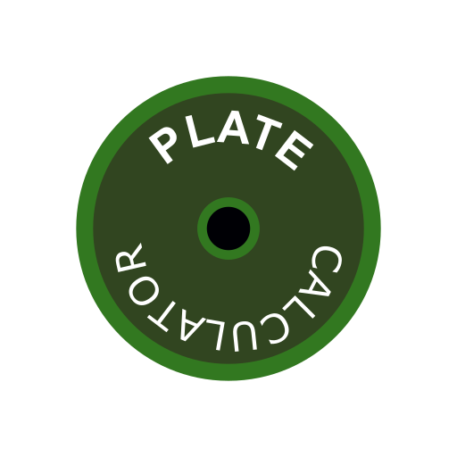
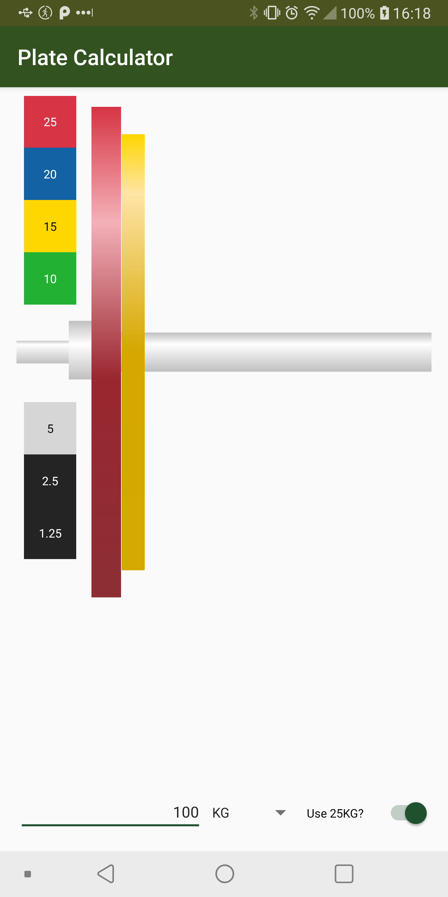
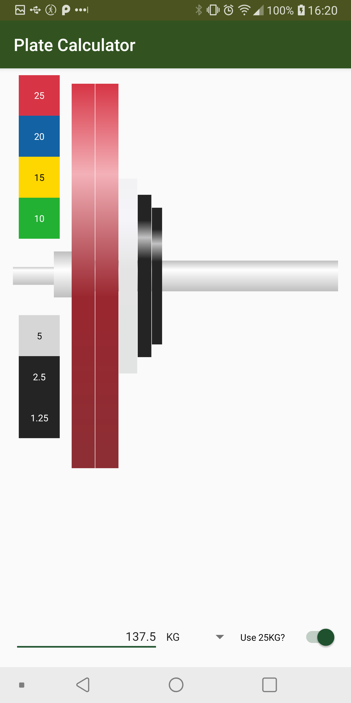

### PlateCalculator 

#### Here are some screenshots
   

The first two show toggling the 25KG plate. The last two show that toggling between LB and KG automatically applies the converstion between the two units and updates the rest of the UI. 

#### Motivation
This is actually a fragment from a previous app (PrWorkoutTracker) that is still a WIP, realized the previous app doesn't really have a use anymore so abstracted this out into its own app. Initially made this cause I wanted a more simple plate calculator app and one without ads. Alas as I spend more time in the gym the less I need this app, so I doubt this project will progress further than the current state.

#### Main Issues
Currently the app doesn't work very well with various orientations/dpis/aspect ratios as it is a relatively complex interface (for me) (with the dynamically added images/plate labels in the left hand corner/etc) and I didn't really have the time to put more effort into it than I already have. If anyone actually starts using the app, I may revist it. Also developed on a phone with a relatively high dpi, so it will be biased towards that. 
