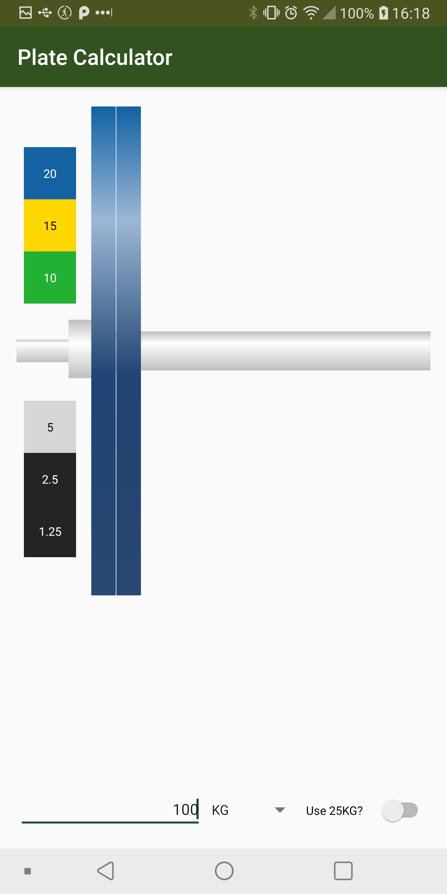

### PlateCalculator 

#### Here are some screenshots
   

The first two show toggling the 25KG plate. The last two show that toggling between LB and KG automatically applies the converstion between the two units and updates the rest of the UI. 

#### Motivation
This is actually a fragment from a previous app (PrWorkoutTracker) that is still a WIP, realized the previous app doesn't really have a use anymore so abstracted this out into its own app. Initially made this cause I wanted a more simple plate calculator app and one without ads. Alas as I spend more time in the gym the less I need this app, so I doubt this project will progress further than the current state.
